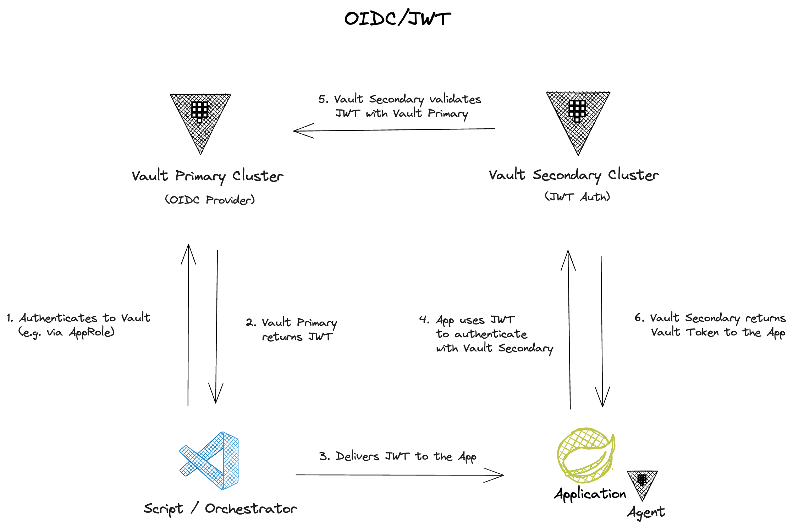

# Vault as OIDC Provider - JWT Auth




Links:

- [Vault as an OIDC identity provider](https://developer.hashicorp.com/vault/tutorials/auth-methods/oidc-identity-provider)
- [JWT/OIDC - Auth Methods](https://developer.hashicorp.com/vault/docs/auth/jwt)

## Primary Cluster - Setup OIDC Provider

### Configure the Vault authentication method

```sh
vault login
vault auth enable approle

vault policy write oidc-auth - << EOF
path "identity/oidc/provider/my-provider/authorize" {
  capabilities = [ "read" ]
}
path "identity/oidc/token/test" {
  capabilities = [ "read" ]
}
EOF

vault write auth/approle/role/my-app \
    token_policies="oidc-auth" \
    token_ttl="1h"

ROLE_ID=$(vault read -field=role_id auth/approle/role/my-app/role-id)
```

### Create Vault entity and group

```sh
vault write identity/entity \
    name="my-app" \
    metadata=AppName="my-app" \
    metadata=Environment="dev" \
    metadata=LobName="sea" \
    metadata=TeamName="sa" \
    disabled=false

ENTITY_ID=$(vault read -field=id identity/entity/name/my-app)

vault write identity/group \
    name="sa-group" \
    member_entity_ids="${ENTITY_ID}"

GROUP_ID=$(vault read -field=id identity/group/name/sa-group)

APPROLE_ACCESSOR=$(vault auth list -detailed -format json | jq -r '.["approle/"].accessor')

vault write identity/entity-alias \
    name="${ROLE_ID}" \
    canonical_id="${ENTITY_ID}" \
    mount_accessor="${APPROLE_ACCESSOR}"
```

### Create an OIDC client

```sh
vault write identity/oidc/assignment/my-assignment \
    entity_ids="${ENTITY_ID}" \
    group_ids="${GROUP_ID}"

vault write identity/oidc/key/my-key \
    allowed_client_ids="*" \
    verification_ttl="2h" \
    rotation_period="1h" \
    algorithm="RS256"

VAULT_LB_SECONDARY=vault-secondary

vault write identity/oidc/client/vault-secondary \
    redirect_uris="https://${VAULT_LB_SECONDARY}:8200/ui/vault/auth/oidc/oidc/callback,http://localhost:8250/oidc/callback,http://127.0.0.1:8250/oidc/callback" \
    assignments="my-assignment" \
    key="my-key" \
    id_token_ttl="30m" \
    access_token_ttl="1h"

vault read identity/oidc/client/vault-secondary

CLIENT_ID=$(vault read -field=client_id identity/oidc/client/vault-secondary)
echo $CLIENT_ID
```

### Create an OIDC provider

```sh
APP_SCOPE_TEMPLATE='{
    "appname": {{identity.entity.name}},
    "metadata": {
        "environment": {{identity.entity.metadata.Environment}},
        "lob": {{identity.entity.metadata.LobName}},
        "team": {{identity.entity.metadata.TeamName}}
    }
}'


vault write identity/oidc/scope/user \
    description="The app scope provides claims using Vault identity entity metadata" \
    template="$(echo ${APP_SCOPE_TEMPLATE} | base64 -)"

GROUPS_SCOPE_TEMPLATE='{
    "groups": {{identity.entity.groups.names}}
}'

vault write identity/oidc/scope/groups \
    description="The groups scope provides the groups claim using Vault group membership" \
    template="$(echo ${GROUPS_SCOPE_TEMPLATE} | base64 -)"

vault write identity/oidc/provider/my-provider \
    allowed_client_ids="${CLIENT_ID}" \
    scopes_supported="groups,user"

curl -sk $VAULT_ADDR/v1/identity/oidc/provider/my-provider/.well-known/openid-configuration | jq

curl -sk $VAULT_ADDR/v1/identity/oidc/provider/my-provider/.well-known/keys | jq
```

```sh
vault write identity/oidc/role/test \
  key="my-key" \
  ttl="30m" \
  client_id="my-app-role" \
  template="$(echo ${APP_SCOPE_TEMPLATE} | base64 -)"

vault read auth/approle/role/my-app/role-id
vault write -f auth/approle/role/my-app/secret-id
```

```sh
sudo cat /etc/vault.d/vault.ca
```

## Secondary Cluster - Setup JWT Auth

```sh
cat <<EOF > /home/rocky/vault-primary.ca
-----BEGIN CERTIFICATE-----
...
-----END CERTIFICATE-----
EOF

vault login

VAULT_LB_PRIMARY=vault-primary

vault auth enable jwt

vault write auth/jwt/config \
  oidc_discovery_url="https://${VAULT_LB_PRIMARY}:8200/v1/identity/oidc/provider/my-provider" \
  oidc_client_id="" \
  oidc_client_secret="" \
  oidc_discovery_ca_pem=@/home/rocky/vault-primary.ca

vault write auth/jwt/role/my-app-role \
  bound_audiences="my-app-role" \
  user_claim="appname" \
  token_policies="my-app-policy" \
  role_type="jwt"
```

### Create entity

```sh
vault write identity/entity \
    name="my-app" \
    metadata=AppName="my-app" \
    metadata=Environment="dev" \
    metadata=LobName="sea" \
    metadata=TeamName="sa" \
    disabled=false

ENTITY_ID=$(vault read -field=id identity/entity/name/my-app)

APPROLE_ACCESSOR=$(vault auth list -detailed -format json | jq -r '.["jwt/"].accessor')

vault write identity/entity-alias \
    name="my-app" \
    canonical_id="${ENTITY_ID}" \
    mount_accessor="${APPROLE_ACCESSOR}"
```

### Setup policy

```sh
tee ./my-app-policy.hcl <<EOF
# Allows to read K/V secrets 
path "secret/data/{{identity.entity.metadata.LobName}}/{{identity.entity.metadata.TeamName}}/{{identity.entity.metadata.AppName}}/*" {
    capabilities = ["create", "update", "read", "delete", "patch"]
}
# Allows reading K/V secret versions and metadata
path "secret/metadata/{{identity.entity.metadata.LobName}}/{{identity.entity.metadata.TeamName}}/{{identity.entity.metadata.AppName}}/*" {
      capabilities = ["list", "read"]
}
EOF

vault policy write my-app-policy ./my-app-policy.hcl
```

### Setup K/V

```sh
vault secrets enable -path=secret kv-v2

# Create some secrets to reflect the path structure
vault kv put -mount=secret sea/sa/my-app/test \
  user=hello-db \
  password=s3cret
```

## Test Instance - JWT Auth

### Login to the primary cluster with AppRole

```sh
export VAULT_ADDR=https://vault-primary:8200
export VAULT_SKIP_VERIFY=true
export ROLE_ID=9ba..
export SECRET_ID=9c1..

unset VAULT_TOKEN

vault write -field=token auth/approle/login \
  role_id="${ROLE_ID}" \
  secret_id="${SECRET_ID}" \
  > ./vault-primary-token

cat ./vault-primary-token

# Retrieve JWT Token
VAULT_TOKEN=$(cat ./vault-primary-token) vault read -field=token \
  identity/oidc/token/test \
  > ./jwt-token

cat ./jwt-token
```

### Login to the secondary cluster with JWT

```sh
export VAULT_ADDR=https://vault-secondary:8200
export VAULT_SKIP_VERIFY=true

unset VAULT_TOKEN

vault write -field=token auth/jwt/login \
  role=my-app-role \
  jwt=$(cat ./jwt-token) \
  > ./vault-secondary-token

VAULT_TOKEN=$(cat ./vault-secondary-token) vault kv get \
  -mount=secret sea/sa/my-app/test
```
