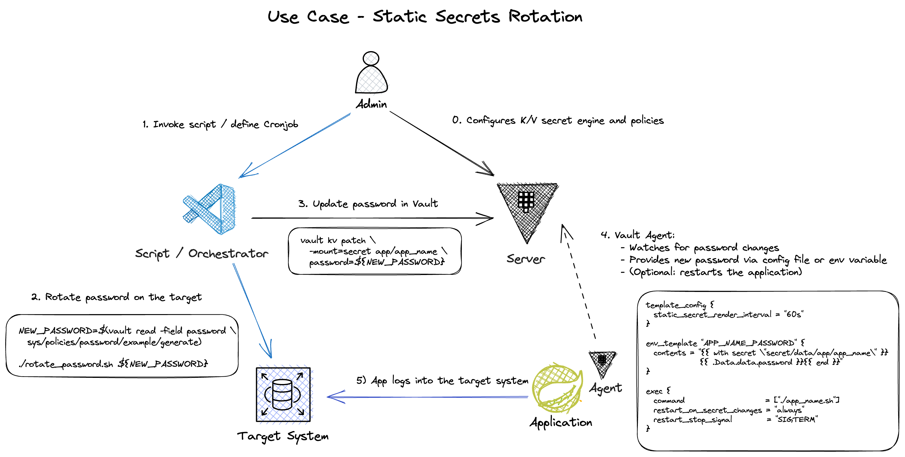

# Vault Agent - Static Secret Rotation



## Rotate a password in Vault via script

Setup K/V secret engine and password policy:

```sh
# Create an example password policy
vault write sys/policies/password/example policy=-<<EOF
  length=20
  rule "charset" {
    charset = "abcdefghij0123456789"
    min-chars = 1
  }
  rule "charset" {
    charset = "!@#$%^&*STUVWXYZ"
    min-chars = 1
  }
EOF

# Setup mount point for K/V version 2
vault secrets enable -path=secret kv-v2

# Create the initial secret
vault kv put -mount=secret app/app_name \
  user=hello \
  password=$(vault read -field password sys/policies/password/example/generate)
# Test
vault kv get -mount=secret app/app_name
```

Define a script that simulates the password rotation:

```sh
vim ./rotate_secret.sh
```

```sh
#!/bin/sh
set -euo pipefail

# vault kv put -mount=secret app/app_name user=hello password=vault

if (( $# < 1 ))
  then
    echo " Please provide the name of the application, e.g.:"
    echo " ${0} app_name"
    exit 1
fi

# Read username, password, and version
SECRET=$(vault kv get -mount=secret -format=json app/${1}) 
USERNAME=$( jq -r  '.data.data.user' <<< "${SECRET}" ) 
LATEST_PASSWORD=$( jq -r  '.data.data.password' <<< "${SECRET}" ) 
LATEST_VERSION=$( jq -r  '.data.metadata.version' <<< "${SECRET}" ) 

# Generate the new password
NEW_PASSWORD=$(vault read -field password sys/policies/password/example/generate)

# Store the new password using CAS
vault kv patch \
  -cas=${LATEST_VERSION} \
  -mount=secret app/${1} \
  password=${NEW_PASSWORD}

# Store the current password as metadata
vault kv metadata put \
  -custom-metadata="lastpassword=${LATEST_PASSWORD}" \
  -mount=secret app/${1}

# Command for changing the external system
echo
echo "==== Demo Secret Rotation ===="
echo "APPNAME      = ${1}"
echo "USERNAME     = ${USERNAME}"
echo "PASSWORD     = ${NEW_PASSWORD}"
echo "LASTPASSWORD = ${LATEST_PASSWORD}"
```

```sh
# Test the script
chmod +x ./rotate_secret.sh
./rotate_secret.sh app_name
```

### Trigger App Rotation

Define an example application that reads ENV variables:

```sh
cat <<EOF | tee ./demo.sh
#!/bin/sh
echo
echo "==== Demo App 1 ===="
echo "APP_NAME_USER         = \${APP_NAME_USER}"
echo "APP_NAME_PASSWORD     = \${APP_NAME_PASSWORD}"
echo "APP_NAME_LASTPASSWORD = \${APP_NAME_LASTPASSWORD}"

sleep 100
EOF

chmod +x ./demo.sh
```

Define the Vault Agent configuration that invokes the example application:

```sh
vim ./agent.hcl
```

```hcl
auto_auth {

  method {
    type = "token_file"

    config {
      token_file_path = "/Users/jrepnak/.vault-token"
    }
  }
}

template_config {
  static_secret_render_interval = "5s"
  exit_on_retry_failure         = true
}

vault {
  address = "http://127.0.0.1:8200"
}

env_template "APP_NAME_USER" {
  contents             = "{{ with secret \"secret/data/app/app_name\" }}{{ .Data.data.user }}{{ end }}"
  error_on_missing_key = true
}
env_template "APP_NAME_PASSWORD" {
  contents             = "{{ with secret \"secret/data/app/app_name\" }}{{ .Data.data.password }}{{ end }}"
  error_on_missing_key = true
}
env_template "APP_NAME_LASTPASSWORD" {
  contents             = "{{ with secret \"secret/data/app/app_name\" }}{{ .Data.metadata.custom_metadata.lastpassword }}{{ end }}"
  error_on_missing_key = true
}

exec {
  command                   = ["./demo.sh"]
  restart_on_secret_changes = "always"
  restart_stop_signal       = "SIGTERM"
}
```

Run the Vault Agent:

```sh
# Vault Agent runs as a daemon
vault agent \
  -config=agent.hcl \
  -log-level=error 
```

Rotate the password:

```sh
# In a second terminal run the rotation script 
./rotate_secret.sh app_name
```